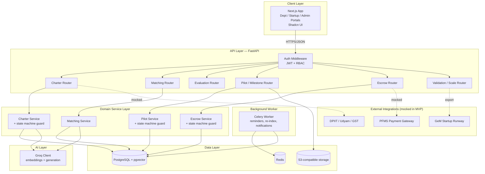
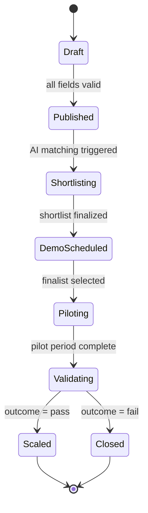
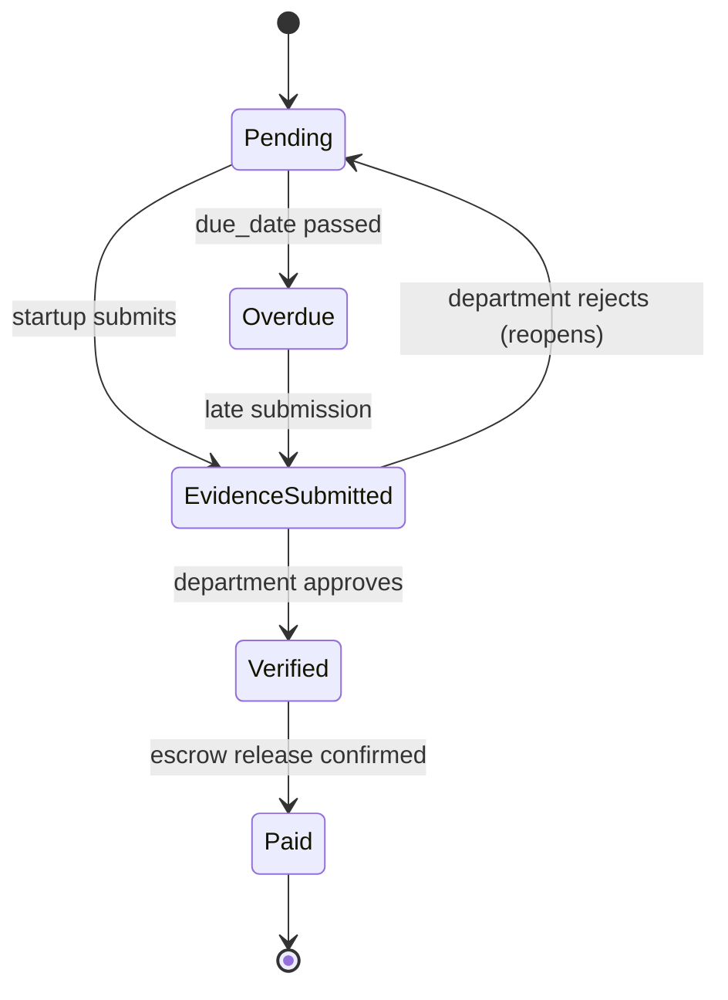

# SPARSH — System Architecture, SRS, Diagrams & Responsiveness Guide
**Stack:** Next.js (App Router) · FastAPI · PostgreSQL + pgvector · Shadcn/UI · Groq

---

## 1. System Architecture

### 1.1 Architectural Style
SPARSH is a **layered, API-first monolith** for MVP (not microservices — three roles and six pipeline stages don't justify that complexity yet). The one deliberate architectural rule: **every pipeline stage transition is guarded by a state machine in the service layer**, so illegal actions (e.g. releasing payment before evidence is verified) are rejected by the backend regardless of what the UI allows.

### 1.2 Layers

| Layer | Responsibility | Tech |
|---|---|---|
| Presentation | Role-scoped UI, forms, dashboards | Next.js App Router, Shadcn/UI, TanStack Query for server-state |
| API Gateway | Auth, request validation, rate limiting | FastAPI routers + middleware |
| Service/Domain | Business rules, state machine guards, orchestration | Python service classes (one per domain: charters, matching, pilots, escrow, validation) |
| AI/Inference | Embeddings, matching, generative feedback | Groq client wrapper (async) |
| Data | Persistence, vector search | PostgreSQL 16 + pgvector, SQLAlchemy 2.0, Alembic migrations |
| Integration | External systems | GeM Startup Runway, DPIIT registry, Udyam/GST, PFMS (mocked in MVP) |
| Infra/Cross-cutting | Jobs, notifications, audit, storage | Celery + Redis, S3-compatible storage, append-only audit log table |

### 1.3 Deployment Topology (MVP)

```
Browser (Next.js SSR/CSR)
     │  HTTPS
     ▼
Next.js server (Vercel / Node host)
     │  REST/JSON, typed via OpenAPI client
     ▼
FastAPI app (containerized, e.g. Docker on state cloud / Render / Fly.io)
     │
     ├──► PostgreSQL + pgvector (managed instance)
     ├──► Redis (Celery broker + cache)
     ├──► S3-compatible object storage (documents, evidence files)
     └──► Groq API (external, HTTPS)

Background worker (Celery) ── shares same Postgres/Redis ── handles:
  reminders, overdue-milestone flags, embedding re-index, notification dispatch
```

### 1.4 Why this shape
- **Next.js talks to FastAPI, never directly to Postgres or Groq** — keeps all business rules and audit logging server-side and in one place.
- **pgvector instead of a separate vector DB** — at hackathon/MVP scale (hundreds to low-thousands of startups per state), a vector column with an IVFFlat/HNSW index on Postgres is enough, and it keeps relational integrity (Charter ↔ embedding ↔ Application) in a single transaction boundary.
- **Celery worker is separate from the API process** — so a slow embedding re-index or a batch of overdue-milestone checks never blocks a department officer clicking "verify milestone."

---

## 2. SRS — Software Requirements Specification

### 2.1 Purpose
Define the functional and non-functional requirements for SPARSH, a digital pipeline enabling Maharashtra government departments to identify, pilot, procure, and scale innovative solutions from eligible startups, per SIH PS 26136.

### 2.2 Scope
In scope: Charter creation, AI-assisted startup discovery/matching, demo evaluation, milestone-based piloting with simulated escrow, independent validation, and scale-up decisioning — for department, startup, and MSInS admin roles.
Out of scope (MVP): real fund transfer via PFMS, live production integration with GeM/DPIIT APIs (mocked instead), CERT-In formal audit execution.

### 2.3 Actors
- **Department Officer** — posts challenges, reviews shortlist, verifies milestones, decides on scale-up.
- **Startup Founder/Rep** — applies, pilots, submits evidence, tracks payment.
- **MSInS Admin** — configures templates/rules, manages evaluator/validator panels, oversees escrow and analytics.
- **Evaluator** — scores startups at Demo Day.
- **Validator** — independently certifies pilot outcomes.

### 2.4 Functional Requirements

**FR-1 Challenge Charter**
- FR-1.1 Guided multi-step form: Problem → Success Metric → Budget Ceiling → Timeline → Data Sensitivity → Eligibility Rules.
- FR-1.2 Real-time AI (Groq) completeness/quality feedback per step.
- FR-1.3 Publish blocked until all required fields validate.
- FR-1.4 Pre-approved legal templates (pilot agreement, IP/data clause, NDA) auto-attach.

**FR-2 Startup Discovery & Application**
- FR-2.1 Search/filter open Charters by sector, budget, department, sensitivity.
- FR-2.2 DPIIT/Udyam/GST fields with verification status.
- FR-2.3 Auto-flag eligibility relaxation per GFR Rule 173/174.
- FR-2.4 Application = capability statement + pitch deck + "why us" text (feeds matching).

**FR-3 AI Matching**
- FR-3.1 On publish: generate Charter embedding, cosine-similarity match against Startup capability embeddings (pgvector).
- FR-3.2 Auto-shortlist top-N (default 10); manual override allowed.
- FR-3.3 Groq generates a short justification per match.
- FR-3.4 Shortlist generation completes in <15s (p95).

**FR-4 Demo Day & Evaluation**
- FR-4.1 Admin schedules Demo Day, assigns ≥3 evaluators.
- FR-4.2 Weighted rubric scoring (technical fit, feasibility, cost realism, team capability).
- FR-4.3 Aggregate score computed; ties flagged for manual resolution.
- FR-4.4 Selected finalist(s) → pilot; others get templated feedback.

**FR-5 Milestone Pilot & Escrow**
- FR-5.1 3–5 milestones defined jointly; amounts sum to budget ceiling.
- FR-5.2 Startup submits evidence per milestone.
- FR-5.3 Department verifies (→ triggers release) or rejects with reason (reopens, one extension allowed).
- FR-5.4 Escrow ledger: `reserved → released` states, logged not auto-transferred in MVP.
- FR-5.5 Overdue milestones auto-flagged + reminder notification.

**FR-6 Independent Validation**
- FR-6.1 Admin assigns a validator distinct from department/evaluator.
- FR-6.2 Structured report: metrics vs. original success metric, pass/conditional/fail.
- FR-6.3 Report visible to department + MSInS; not department-editable.

**FR-7 Scale-Up**
- FR-7.1 Scale decision: statewide / departmental / reject, with rationale.
- FR-7.2 Auto-generate GeM listing draft (structured export) for statewide scale.
- FR-7.3 Successful pilots listed in a public, read-only Success Registry.

**FR-8 Cross-cutting**
- FR-8.1 Full audit log (who/when/what) on every state transition.
- FR-8.2 Role-based dashboards.
- FR-8.3 Notifications: shortlist ready, demo scheduled, milestone due/overdue, payment released, validation complete.
- FR-8.4 Templated PDF generation: Charter, Pilot Agreement, Validation Report.

### 2.5 Non-Functional Requirements

| Category | Requirement |
|---|---|
| Security | RBAC at API layer; uploaded docs scanned; immutable append-only audit table; CERT-In-aligned review pre-production. |
| Data/IP | Sensitivity tier per Charter; high-sensitivity pilots require signed data agreement before data access is granted — enforced in workflow. |
| Performance | AI shortlist <15s p95; dashboard TTI <2s. |
| Availability | 99.5% target during business hours (MVP). |
| Auditability | Every payment release, score, and validation outcome traceable to a user + timestamp. |
| Accessibility | WCAG 2.1 AA minimum. |
| Extensibility | Pipeline must work unmodified for any state/department — no hardcoded Maharashtra-only logic in the data model. |

### 2.6 External Interface Requirements
- GeM Startup Runway API (startup/order data) — mocked in MVP, real integration post-MVP.
- DPIIT Startup India registry — eligibility verification.
- Udyam/GST APIs — business identity verification.
- PFMS — payment gateway (stubbed as ledger-only in MVP).
- Groq API — embeddings + generative feedback/justification.

---

## 3. Architecture Diagram

### 3.1 High-level component diagram (Mermaid)



### 3.2 Pipeline state machine (per Challenge Charter)



### 3.3 Milestone/escrow sub-state machine (per Milestone)



---

## 4. Screen Ideas (functional wireframe spec — apply your design.md for visuals)

### 4.1 Department Portal
| Screen | Core elements |
|---|---|
| Dashboard | Kanban by stage, pending-action counters, budget-committed summary |
| New Charter Wizard | 5-step form, side-panel live AI feedback, progress stepper |
| Charter Detail / Shortlist | Charter summary card + shortlist table (score, AI justification, verify badge), manual add/remove |
| Demo Day Scheduler | Calendar picker, evaluator multi-select, startup invite list |
| Pilot Setup | Milestone builder (drag-reorder rows), live remaining-budget indicator |
| Milestone Review Queue | List + inline document/evidence viewer, verify/reject actions with reason field |
| Validation Report Viewer | Read-only report, metrics chart, pass/conditional/fail badge |
| Scale Decision | Decision form, auto-generated GeM listing draft preview, rationale text |

### 4.2 Startup Portal
| Screen | Core elements |
|---|---|
| Dashboard | Application status cards, upcoming milestone deadlines, payment timeline |
| Discover Challenges | Filterable card/list grid, sector/budget/sensitivity chips |
| Charter Detail + Apply | Full problem description, apply form, document upload |
| My Applications | Status tracker (stepper: Applied → Shortlisted → Demo → Selected/Rejected) |
| Pilot Workspace | Milestone list, evidence upload per row, status badges |
| Escrow/Payment Tracker | Ledger table: reserved / released / pending per milestone |
| Profile & Verification | DPIIT/Udyam/GST fields, verification badges |

### 4.3 MSInS Admin Portal
| Screen | Core elements |
|---|---|
| Control Center | Cross-department analytics, escrow totals, avg time-to-pilot, success rate |
| Template Manager | CRUD for legal templates, eligibility rules, rubric weights |
| Evaluator/Validator Directory | Assign panel to Charter, conflict-of-interest flag |
| Evaluation Console | Weighted rubric sliders, notes field, submit score |
| Escrow Oversight | Global ledger, overdue-milestone alert list |
| Success Registry (public) | Read-only showcase grid, searchable/filterable |
| Audit Log Viewer | Filterable table (user, action, timestamp), export |

### 4.4 Shared
Auth/login (role-based redirect), org verification-pending state, notification center, document viewer/generator.

---

## 5. Responsiveness Guide

### 5.1 Breakpoints (Tailwind defaults — align with Shadcn)
| Breakpoint | Width | Primary target |
|---|---|---|
| `base` | <640px | Mobile — startup founders checking status on the go |
| `sm` | ≥640px | Large phone / small tablet |
| `md` | ≥768px | Tablet — occasional department officer use |
| `lg` | ≥1024px | Small laptop — primary target for admin/evaluator workflows |
| `xl` | ≥1280px | Desktop — primary target for department dashboards, Charter wizard |
| `2xl` | ≥1536px | Wide desktop — dense data tables (escrow oversight, audit log) |

### 5.2 Role-based responsive priority
Not all roles need equal mobile investment — design effort should follow real usage:

- **Startup portal → mobile-first.** Founders check application status and milestone deadlines from phones between meetings. Discover Challenges, My Applications, Pilot Workspace, and Payment Tracker must be fully usable at `base`.
- **Department portal → desktop-first, tablet-capable.** Charter creation and milestone verification involve reading dense text and documents — optimize for `lg`+, but Dashboard and Milestone Review Queue should degrade gracefully to `md` (tablet, e.g. reviewing evidence at a site visit).
- **MSInS Admin portal → desktop-only is acceptable for MVP.** Analytics, audit logs, and rubric configuration are inherently dense; a "best viewed on desktop" banner below `md` is a reasonable MVP cut.

### 5.3 Component-level rules
| Component pattern | Desktop (`lg`+) | Mobile (`base`–`sm`) |
|---|---|---|
| Kanban dashboard (Charter stages) | Horizontal columns, all visible | Vertical stack, one stage per swipeable section or accordion |
| Charter Wizard | Side-by-side form + AI feedback panel | Stacked: form full-width, AI feedback as a collapsible drawer/sheet below the active field |
| Shortlist / data tables | Full table (score, justification, actions inline) | Card list — one startup per card, justification as expandable text, actions as bottom sheet |
| Milestone builder | Multi-column row editor with drag-reorder | Single-column stacked cards, reorder via up/down buttons (drag is unreliable on touch for this density) |
| Evidence/document viewer | Side panel or modal, document + verify controls visible together | Full-screen takeover, verify/reject as sticky bottom action bar |
| Escrow ledger | Dense table | Grouped list by milestone, amount as the primary visual element |
| Navigation | Persistent sidebar (role-scoped) | Bottom tab bar (3–4 primary destinations) + hamburger for secondary |
| Notifications | Dropdown panel from top bar | Dedicated full-screen route, accessible from bottom tab |

### 5.4 Interaction adjustments for touch
- All primary actions (Verify, Submit Evidence, Apply) get a minimum 44×44px touch target.
- Multi-step forms (Charter Wizard, Milestone Builder) use a persistent progress indicator and "Save & Continue" per step — never a single long scroll on mobile, since officers/founders often complete these in short sessions.
- Drag-and-drop reordering (milestones, evaluator assignment) needs an explicit non-drag fallback (up/down buttons or a reorder modal) below `md`.
- Tables with >4 columns should never render as horizontally-scrolling tables on mobile — convert to cards; horizontal scroll on data tables is a common accessibility failure point and should be avoided per FR non-functional accessibility requirement (§2.5).

### 5.5 Testing matrix (minimum)
- 375×667 (small phone) — startup portal core flows
- 768×1024 (tablet, portrait) — department milestone review
- 1280×800 (small laptop) — all portals
- 1536×864 (desktop) — admin analytics/audit log

